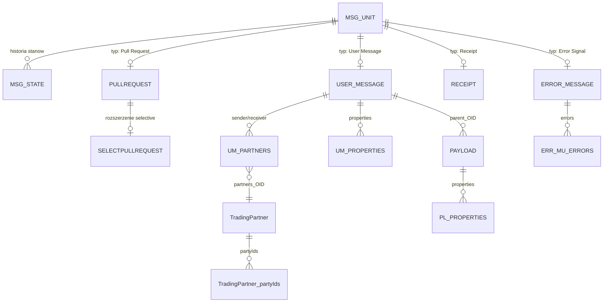

# Baza danych Holodeck B2B 7.0.0 - przewodnik integracyjny

## 1. Cel i zakres

Ten dokument opisuje sposob, w jaki ta wersja Holodeck B2B zapisuje i odczytuje dane, oraz kontrakt, ktory powinien przyjac system zewnetrzny czytajacy baze bezposrednio. Opis powstal na podstawie kodu z commita `ee0a17f8` i lokalnego DDL wygenerowanego dla SQL Servera. Stan analizy: 2026-07-22.

Najwazniejsze ograniczenie: baza zawiera **metadane wiadomosci i payloadow, ale nie zawiera tresci payloadow**. Domyslny `PayloadStorageProvider` zapisuje tresc w systemie plikow. Integracja oparta tylko na SQL nie odtworzy kompletnej wiadomosci biznesowej.

Schemat bazy jest wewnetrznym modelem modulu `holodeckb2b-default-mds`, a nie stabilnym, wersjonowanym publicznym API. Dla zapisu nalezy uzywac interfejsow Holodecka. Bezposredni dostep do SQL powinien byc tylko do odczytu i najlepiej odbywac sie przez kontrolowane widoki integracyjne.

### W skrocie

- Silnik: Microsoft SQL Server, dialekt Hibernate `SQLServer2016Dialect`.
- ORM: JPA/Hibernate 5.6.15.Final, transakcje `RESOURCE_LOCAL`.
- Konfiguracja polaczenia: `HB2B_DB_URL`, `HB2B_DB_USER`, `HB2B_DB_PASSWORD`.
- Schemat nie jest wersjonowany migracjami; Hibernate uruchamia `hbm2ddl.auto=update` przy starcie.
- Glowny rekord to `MSG_UNIT`; konkretny typ wynika z obecnosci rekordu w tabeli potomnej.
- Aktualny stan to rekord `MSG_STATE` o najwiekszym `PROC_STATE_NUM` dla danej wiadomosci.
- `MSG_UNIT.DIRECTION` jest liczba: `0 = IN`, `1 = OUT`. `PAYLOAD.DIRECTION` jest tekstem: `IN` albo `OUT`.
- `MESSAGE_ID` nie jest unikalny w bazie. Duplikaty przychodzace sa dozwolone; unikalnosc wychodzacych sprawdza aplikacja.
- `CORE_ID` jest UUID generowanym przez aplikacje, ale baza nie ma ograniczenia `UNIQUE`.
- Retencja jest domyslnie ustawiona na 30 dni i moze usuwac rekordy niezaleznie od tego, czy stan jest finalny.
- Klucze obce nie maja `ON DELETE CASCADE`; usuwanie koordynuje Hibernate i warstwa `StorageManager`.

## 2. Architektura przechowywania

Holodeck rozdziela przechowywanie na dwa providery:

1. `IMetadataStorageProvider` - metadane w SQL Serverze. Domyslna implementacja to `DefaultMetadataStorageProvider`.
2. `IPayloadStorageProvider` - binarna lub tekstowa tresc dokumentow biznesowych. Domyslna implementacja to `DefaultPayloadStorageProvider`, ktory uzywa systemu plikow.

`StorageManager` laczy obie warstwy, ale nie zapewnia jednej transakcji obejmujacej SQL Server i system plikow. W rezultacie chwilowo, a po awarii takze trwale, moze istniec:

- metadana `PAYLOAD` bez odpowiadajacego pliku;
- plik bez metadanych;
- wiadomosc w stanie `FAILURE`, gdy zapis metadanych udal sie, a zapis tresci nie.

Domyslna lokalizacja tresci to:

```text
<katalog tymczasowy Holodecka>/pldata/<PAYLOAD.PAYLOAD_ID>
```

Parametr tekstowy `payload-directory` w konfiguracji Holodecka moze ustawic inny katalog. Nazwa pliku jest dokladnie wartoscia `PAYLOAD_ID`, bez rozszerzenia. `PAYLOAD.URI` nie jest sciezka pliku i nie moze sluzyc do jego odnalezienia.

### Konfiguracja i uruchamianie

Provider wymaga wszystkich trzech zmiennych srodowiskowych:

| Zmienna | Znaczenie |
|---|---|
| `HB2B_DB_URL` | Pelny JDBC URL SQL Servera, lacznie z nazwa bazy i wymaganymi parametrami TLS. |
| `HB2B_DB_USER` | Login uzywany przez Hibernate. |
| `HB2B_DB_PASSWORD` | Haslo loginu. |

Brak lub pusta wartosc zatrzymuje inicjalizacje providera. Kod nie ustawia nazwy schematu, dlatego obiekty sa tworzone w domyslnym schemacie uzytkownika bazy, zwykle `dbo`, ale integracja nie powinna tego zakladac bez sprawdzenia.

Istotne ustawienia Hibernate:

| Ustawienie | Wartosc | Skutek |
|---|---:|---|
| `hibernate.hbm2ddl.auto` | `update` | Hibernate tworzy i rozszerza schemat podczas startu. Nie jest to pelny mechanizm migracji ani rollbacku. |
| `hibernate.jdbc.batch_size` | `20` | Zapisy moga byc grupowane po 20 instrukcji. |
| cache drugiego poziomu | wylaczony | Odczyty nie korzystaja z L2 cache. |
| query cache | wylaczony | Zapytania trafiaja do bazy. |
| `show_sql` | `false` | SQL nie jest domyslnie logowany. |
| typ transakcji | `RESOURCE_LOCAL` | Kazda operacja providera zarzadza lokalna transakcja JPA. Brak JTA. |

Kod konfiguracyjny nie dostarcza `DataSource` ani zewnetrznego poola. Sposob zestawiania polaczen nalezy potwierdzic w konkretnej dystrybucji i monitorowac po stronie SQL Servera.

## 3. Model logiczny

### Dziedziczenie typow wiadomosci

JPA uzywa strategii `JOINED`. Kazdy typ ma rekord w `MSG_UNIT` i rekord z tym samym `OID` w tabeli potomnej:

| Typ logiczny | Wymagane rekordy |
|---|---|
| User Message | `MSG_UNIT` + `USER_MESSAGE` |
| Error Signal | `MSG_UNIT` + `ERROR_MESSAGE` |
| Receipt Signal | `MSG_UNIT` + `RECEIPT` |
| Pull Request | `MSG_UNIT` + `PULLREQUEST`, bez `SELECTPULLREQUEST` |
| Selective Pull Request | `MSG_UNIT` + `PULLREQUEST` + `SELECTPULLREQUEST` |

Nie ma kolumny discriminatora. Adnotacje `@DiscriminatorValue` nie tworza w tym schemacie kolumny typu. Przy klasyfikacji trzeba najpierw sprawdzac `SELECTPULLREQUEST`, a dopiero potem zwykly `PULLREQUEST`.

### Diagram ER



W diagramie `o|` przy tabelach potomnych oznacza relacje wynikajaca z modelu. Baza nie ma ograniczenia, ktore wymusza dokladnie jeden typ potomny dla kazdego `MSG_UNIT` ani zabrania sprzecznych rekordow kilku typow.

### Identyfikatory

| Identyfikator | Zakres i semantyka |
|---|---|
| `OID` | Techniczny `bigint`, klucz encji JPA. Generowany ze wspolnej sekwencji `hibernate_sequence`. Nie nalezy wystawiac go jako trwale publiczne ID poza integracja z ta konkretna baza. |
| `CORE_ID` | UUID generowany przez Holodeck dla kazdej wiadomosci. Najlepszy identyfikator techniczny do korelacji z API Holodecka. Brak `UNIQUE`/`NOT NULL` w bazie. |
| `MESSAGE_ID` | Identyfikator ebMS widoczny w protokole. Moze wystepowac wiele razy, szczegolnie dla `DIRECTION=IN`, gdzie duplikaty sa celowo wykrywane w logice aplikacji. |
| `PAYLOAD_ID` | UUID metadanych/tresci payloadu. Jedyna kolumna biznesowa z wymuszona unikalnoscia w DDL. Jest tez nazwa pliku w domyslnym PSP. |
| `PMODE_ID` | ID P-Mode wybranego przez runtime. To logiczne odwolanie do konfiguracji poza baza; brak tabeli i FK. |

`hibernate_sequence` jest wspolna dla `MSG_UNIT`, `PAYLOAD` i `TradingPartner`, dlatego przerwy i przeplatanie wartosci `OID` sa normalne. Nie wolno zakladac ciaglosci ani liczby rekordow na podstawie roznicy identyfikatorow.

## 4. Model stanu przetwarzania

Stan nie jest nadpisywany w `MSG_UNIT`. Kazda zmiana dodaje element do kolekcji `MSG_STATE`:

- `PROC_STATE_NUM` zaczyna sie od `0` i rosnie o 1 w ramach jednego `MSGUNIT_OID`;
- `START` jest czasem utworzenia stanu w JVM;
- `DESCRIPTION` jest obcinany przez aplikacje do 255 znakow;
- aktualny stan to wiersz o najwiekszym `PROC_STATE_NUM`, nie najwiekszym `START`;
- kolejnosc globalna pomiedzy wiadomosciami nie istnieje.

W poprawnych danych para `(MSGUNIT_OID, PROC_STATE_NUM)` jest logicznie unikalna, ale DDL nie ma dla niej `PRIMARY KEY` ani `UNIQUE`. Integracja powinna monitorowac naruszenia tej reguly. Zapytania samego Holodecka uzywaja `MAX(PROC_STATE_NUM)` i przy duplikacie moga zwrocic wiecej niz jeden aktualny stan.

### Wartosci `STATE`

Kolumna przechowuje tekstowa nazwe enuma, z zachowaniem wielkich liter:

| Stan | Finalny | Znaczenie integracyjne |
|---|:---:|---|
| `SUBMITTED` | nie | Wiadomosc uzytkownika lub Pull Request przyjety do wyslania. |
| `CREATED` | nie | Signal utworzony wewnetrznie przez Holodeck. |
| `RECEIVED` | nie | Pierwszy stan odebranej wiadomosci. |
| `AWAITING_PULL` | nie | Wiadomosc czeka na pobranie przez drugi MSH. |
| `READY_TO_PUSH` | nie | Wiadomosc gotowa do wyslania push. |
| `PROCESSING` | nie | Trwa przetwarzanie. |
| `SENDING` | nie | Trwa transfer do drugiego MSH. Kazde wystapienie liczy sie jako proba transmisji. |
| `TRANSPORT_FAILURE` | nie | Problem transportowy; mozliwa dalsza obsluga/retry. |
| `AWAITING_RECEIPT` | nie | Oczekiwanie na Receipt. |
| `READY_FOR_DELIVERY` | nie | Gotowe do dostarczenia/notyfikacji aplikacji biznesowej. |
| `OUT_FOR_DELIVERY` | nie | Trwa dostarczenie/notyfikacja. |
| `DELIVERY_FAILED` | nie | Proba dostarczenia nie udala sie. |
| `WARNING` | nie | Ostrzezenie niekonczace przetwarzania. |
| `SUSPENDED` | nie | Przetwarzanie wstrzymane, potencjalnie do wznowienia. |
| `DELIVERED` | tak | User Message dostarczony do MSH lub aplikacji biznesowej. |
| `DONE` | tak | Signal zakonczony poprawnie. |
| `FAILURE` | tak | Trwale niepowodzenie przetwarzania. |
| `DUPLICATE` | tak | Odebrany User Message uznany za duplikat. |

Nie nalezy wyprowadzac sukcesu tylko z faktu, ze stan jest finalny. `FAILURE` i `DUPLICATE` sa finalne, ale nie oznaczaja sukcesu biznesowego.

## 5. Slownik tabel i kolumn

Typy ponizej odpowiadaja DDL wygenerowanemu przez biezace mapowania dla SQL Servera. Poniewaz aplikacja uzywa automatycznego `update`, rzeczywista instancja moze miec dodatkowe stare kolumny, inne nazwy dawnych constraintow albo recznie dodane indeksy. Przed wdrozeniem integracji trzeba porownac katalog systemowy z tym dokumentem.

`NULL` w kolumnie "Wymagane" oznacza, ze baza dopuszcza `NULL`, nawet jesli specyfikacja ebMS lub kod oczekuje wartosci.

### `MSG_UNIT`

Wspolna czesc kazdej wiadomosci.

| Kolumna | Typ SQL | Wymagane | Znaczenie |
|---|---|:---:|---|
| `OID` | `bigint` | PK | Techniczny klucz z `hibernate_sequence`. |
| `VERSION` | `bigint` | tak | Licznik blokady optymistycznej JPA. Zwieksza sie przy aktualizacji encji; nie jest globalnym numerem zmiany. |
| `CORE_ID` | `varchar(255)` | NULL | UUID nadany przez Holodeck. |
| `DIRECTION` | `int` | NULL | Enum porzadkowy: `0=IN`, `1=OUT`. Inne wartosci sa nieprawidlowe. |
| `MESSAGE_ID` | `varchar(255)` | NULL | ebMS MessageId; nie jest unikalny. |
| `MU_TIMESTAMP` | `datetime2` | NULL | Czas wiadomosci. Bez informacji o strefie czasowej. |
| `PMODE_ID` | `varchar(255)` | NULL | P-Mode wybrany do przetwarzania. |
| `REF_TO_MSG_ID` | `varchar(255)` | NULL | Logiczne odwolanie do `MESSAGE_ID`, bez FK. |
| `USES_MULTI_HOP` | `bit` | tak | Flaga multi-hop. Aplikacja inicjalizuje `false`; DDL nie definiuje `DEFAULT`. |

`DIRECTION`, `MESSAGE_ID`, `CORE_ID` i `PMODE_ID` maja duze znaczenie domenowe, ale ich poprawnosc nie jest wymuszana constraintami.

### `MSG_STATE`

Historia stanow wszystkich typow wiadomosci.

| Kolumna | Typ SQL | Wymagane | Znaczenie |
|---|---|:---:|---|
| `MSGUNIT_OID` | `bigint` | FK | Odbiorca historii, FK do `MSG_UNIT.OID`. |
| `PROC_STATE_NUM` | `int` | tak | Numer 0-based w ramach wiadomosci. |
| `STATE` | `varchar(255)` | NULL | Tekstowa wartosc `ProcessingState`. |
| `START` | `datetime2` | NULL | Poczatek stanu wedlug zegara JVM. |
| `DESCRIPTION` | `varchar(255)` | NULL | Dodatkowy opis diagnostyczny. |

Brak klucza glownego i indeksu w bazowym DDL. Hibernate laduje kolekcje eager i sortuje po `PROC_STATE_NUM`.

### `USER_MESSAGE`

Dane ebMS User Message. `OID` jest jednoczesnie PK i FK do `MSG_UNIT.OID`.

| Kolumna | Typ SQL | Wymagane | Znaczenie |
|---|---|:---:|---|
| `OID` | `bigint` | PK/FK | Wspolny identyfikator z `MSG_UNIT`. |
| `MPC` | `varchar(max)` | NULL | Message Partition Channel. Domyslna wartosc aplikacyjna: `http://docs.oasis-open.org/ebxml-msg/ebms/v3.0/ns/core/200704/defaultMPC`. |
| `CI_ACTION` | `varchar(max)` | NULL | `CollaborationInfo/Action`. |
| `CONVERSATION_ID` | `varchar(max)` | NULL | Identyfikator konwersacji biznesowej. |
| `S_NAME` | `varchar(max)` | NULL | Nazwa serwisu. |
| `S_TYPE` | `varchar(max)` | NULL | Typ serwisu. |
| `A_NAME` | `varchar(255)` | NULL | Nazwa AgreementRef. |
| `A_TYPE` | `varchar(255)` | NULL | Typ AgreementRef. |
| `P_MODE_ID` | `varchar(255)` | NULL | P-Mode ID zawarty w AgreementRef. Nie mylic z `MSG_UNIT.PMODE_ID`. |

`MSG_UNIT.PMODE_ID` opisuje runtime Holodecka. `USER_MESSAGE.P_MODE_ID` jest czescia danych protokolowych AgreementRef i moze byc puste lub miec inna wartosc.

### `UM_PARTNERS`

Tabela laczaca User Message z osobnymi encjami nadawcy i odbiorcy.

| Kolumna | Typ SQL | Wymagane | Znaczenie |
|---|---|:---:|---|
| `UserMessage_OID` | `bigint` | PK/FK | FK do `USER_MESSAGE.OID`. |
| `PARTNERTYPE` | `varchar(255)` | PK | `SENDER` lub `RECEIVER`. |
| `partners_OID` | `bigint` | FK/UNIQUE | FK do `TradingPartner.OID`; partner nalezy tylko do jednej wiadomosci. |

PK `(UserMessage_OID, PARTNERTYPE)` wymusza maksymalnie jednego partnera dla danego tekstowego typu, ale CHECK nie ogranicza wartosci do `SENDER`/`RECEIVER`.

### `TradingPartner`

Instancja partnera jest prywatna dla jednej wiadomosci, nawet gdy ten sam podmiot wystepuje w wielu wiadomosciach.

| Kolumna | Typ SQL | Wymagane | Znaczenie |
|---|---|:---:|---|
| `OID` | `bigint` | PK | Techniczny klucz z `hibernate_sequence`. |
| `TP_ROLE` | `varchar(max)` | NULL | Rola ebMS Party. |

Nie nalezy traktowac `TradingPartner` jako kartoteki kontrahentow ani laczyc rekordow po `OID` pomiedzy wiadomosciami.

### `TradingPartner_partyIds`

Lista identyfikatorow partnera.

| Kolumna | Typ SQL | Wymagane | Znaczenie |
|---|---|:---:|---|
| `TradingPartner_OID` | `bigint` | FK | FK do `TradingPartner.OID`. |
| `P_ID` | `varchar(max)` | NULL | Identyfikator PartyId. Domenowo wymagany, ale nie przez DDL. |
| `P_TYPE` | `varchar(max)` | NULL | Typ PartyId. |

Brak PK, kolejnosci i ograniczenia duplikatow.

### `UM_PROPERTIES`

Dowolne wlasciwosci User Message.

| Kolumna | Typ SQL | Wymagane | Znaczenie |
|---|---|:---:|---|
| `UserMessage_OID` | `bigint` | FK | FK do `USER_MESSAGE.OID`. |
| `NAME` | `varchar(max)` | NULL | Nazwa property. |
| `VALUE` | `varchar(max)` | NULL | Wartosc property. |
| `TYPE` | `varchar(max)` | NULL | Opcjonalny typ wartosci. |

Nazwa nie jest unikalna; poprawna wiadomosc moze miec wiele property o tej samej nazwie. Brak gwarantowanej kolejnosci.

### `PAYLOAD`

Metadane payloadu. Rekord moze istniec samodzielnie przed podpieciem do User Message.

| Kolumna | Typ SQL | Wymagane | Znaczenie |
|---|---|:---:|---|
| `OID` | `bigint` | PK | Techniczny klucz. |
| `PAYLOAD_ID` | `varchar(255)` | UNIQUE, NULL | UUID i klucz do tresci w PSP. SQL Server pozwala na maksymalnie jeden `NULL` w zwyklym indeksie unique. Normalny kod zawsze generuje UUID. |
| `parent_OID` | `bigint` | NULL/FK | FK do `USER_MESSAGE.OID`; `NULL` dla payloadu zlozonego osobno. |
| `DIRECTION` | `varchar(255)` | NULL | `IN`/`OUT` dla payloadu samodzielnego. Dla podpietego payloadu wartosc efektywna pochodzi z rodzica. |
| `PMODE_ID` | `varchar(255)` | NULL | P-Mode payloadu samodzielnego. Dla podpietego payloadu wartosc efektywna pochodzi z rodzica. |
| `CONTAINMENT` | `varchar(255)` | NULL | `BODY`, `ATTACHMENT` albo `EXTERNAL`. |
| `URI` | `varchar(255)` | NULL | URI payloadu w kontekscie wiadomosci; nie lokalna sciezka. |
| `MIME_TYPE` | `varchar(255)` | NULL | MIME type, jezeli byl dostepny. |
| `DESCRIPTION` | `varchar(max)` | NULL | Przestarzaly opis payloadu, maks. 10000 znakow w kodzie. |
| `LANG` | `varchar(255)` | NULL | Jezyk opisu. |
| `LOCATION` | `varchar(max)` | NULL | Lokalizacja schematu dokumentu. |
| `NAMESPACE` | `varchar(max)` | NULL | Namespace schematu. |
| `VERSION` | `varchar(max)` | NULL | Wersja schematu dokumentu; to nie jest licznik blokady. |

`PAYLOAD` nie ma kolumny JPA `@Version`. Aktualizacje metadanych payloadu nie maja takiej ochrony optymistycznej jak `MSG_UNIT` i w praktyce moga zachowywac sie jak last-write-wins.

Efektywne wartosci odczytywane przez kod:

```text
effective direction = parent exists ? MSG_UNIT.DIRECTION : PAYLOAD.DIRECTION
effective P-Mode    = parent exists ? MSG_UNIT.PMODE_ID   : PAYLOAD.PMODE_ID
parent core ID      = parent exists ? MSG_UNIT.CORE_ID    : NULL
```

### `PL_PROPERTIES`

Dowolne wlasciwosci payloadu.

| Kolumna | Typ SQL | Wymagane | Znaczenie |
|---|---|:---:|---|
| `PAYLOAD_OID` | `bigint` | FK | FK do `PAYLOAD.OID`. |
| `NAME` | `varchar(max)` | NULL | Nazwa property. |
| `VALUE` | `varchar(max)` | NULL | Wartosc property. |
| `TYPE` | `varchar(max)` | NULL | Opcjonalny typ wartosci. |

Brak PK, kolejnosci i ograniczenia duplikatow.

### `ERROR_MESSAGE`

Naglowek Error Signal. `OID` jest PK i FK do `MSG_UNIT.OID`.

| Kolumna | Typ SQL | Wymagane | Znaczenie |
|---|---|:---:|---|
| `OID` | `bigint` | PK/FK | Wspolny identyfikator z `MSG_UNIT`. |
| `ADD_SOAP_FAULT` | `bit` | tak | Czy signal powinien byc polaczony z SOAP Fault; ostateczna decyzja zalezy tez od pakowania. |
| `LEG` | `varchar(255)` | NULL | `REQUEST` albo `REPLY`; moze byc `NULL` dla one-way MEP lub braku dopasowania. |

### `ERR_MU_ERRORS`

Poszczegolne bledy ebMS nalezace do Error Signal.

| Kolumna | Typ SQL | Wymagane | Znaczenie |
|---|---|:---:|---|
| `ErrorMessage_OID` | `bigint` | FK | FK do `ERROR_MESSAGE.OID`. |
| `ERROR_CODE` | `varchar(255)` | NULL | Kod bledu, domenowo wymagany. |
| `SEVERITY` | `varchar(255)` | NULL | Dokladnie `warning` albo `failure` - male litery. |
| `ERROR_MESSAGE` | `varchar(max)` | NULL | Krotki opis, do 1024 znakow wedlug mapowania. |
| `ERROR_DETAIL` | `varchar(max)` | NULL | Szczegoly, do 10000 znakow wedlug mapowania. |
| `ORIGIN` | `varchar(255)` | NULL | Modul pochodzenia bledu. |
| `CATEGORY` | `varchar(255)` | NULL | Kategoria bledu. |
| `REF_TO_MSG_IN_ERROR` | `varchar(255)` | NULL | MessageId powodujacy blad; brak FK. |
| `DESCRIPTION_LANG` | `varchar(255)` | NULL | Jezyk dlugiego opisu. |
| `DESCRIPTION_TXT` | `varchar(max)` | NULL | Dlugi opis, do 10000 znakow wedlug mapowania. |

Brak PK i kolumny porzadku. SQL nie gwarantuje kolejnosci bledow.

### `RECEIPT`

Receipt Signal. `OID` jest PK i FK do `MSG_UNIT.OID`.

| Kolumna | Typ SQL | Wymagane | Znaczenie |
|---|---|:---:|---|
| `OID` | `bigint` | PK/FK | Wspolny identyfikator z `MSG_UNIT`. |
| `CONTENT` | `varchar(max)` | NULL | Fragmenty XML Receipt opakowane przez aplikacje w sztuczny element `<receipt_content>`. |

`CONTENT` jest serializowanym XML-em, a nie pojedynczym elementem Receipt. Parser integracji powinien obsluzyc wrapper i wiele dzieci. Kod deklaruje limit 65535 znakow, ale SQL Server przechowuje `varchar(max)`.

### `PULLREQUEST`

Pull Request. `OID` jest PK i FK do `MSG_UNIT.OID`.

| Kolumna | Typ SQL | Wymagane | Znaczenie |
|---|---|:---:|---|
| `OID` | `bigint` | PK/FK | Wspolny identyfikator z `MSG_UNIT`. |
| `MPC` | `varchar(max)` | NULL | Kanal pobierany przez request. |

### `SELECTPULLREQUEST`

Rozszerzenie Selective Pull Request. Ten sam `OID` musi byc obecny takze w `PULLREQUEST` i `MSG_UNIT`.

| Kolumna | Typ SQL | Wymagane | Znaczenie |
|---|---|:---:|---|
| `OID` | `bigint` | PK/FK | FK do `PULLREQUEST.OID`. |
| `REFD_MESSAGE_ID` | `varchar(255)` | NULL | Selekcja po MessageId. |
| `CONVERSATION_ID` | `varchar(max)` | NULL | Selekcja po ConversationId. |
| `S_ACTION` | `varchar(max)` | NULL | Selekcja po Action. |
| `S_NAME` | `varchar(max)` | NULL | Nazwa serwisu. |
| `S_TYPE` | `varchar(max)` | NULL | Typ serwisu. |
| `A_NAME` | `varchar(255)` | NULL | Nazwa AgreementRef. |
| `A_TYPE` | `varchar(255)` | NULL | Typ AgreementRef. |
| `P_MODE_ID` | `varchar(255)` | NULL | P-Mode ID w AgreementRef selekcji. |

## 6. Klucze obce i constrainty

Nazwane elementy w biezacym modelu:

| Constraint | Relacja / warunek |
|---|---|
| `UK_PAYLOAD_PAYLOAD_ID` | `PAYLOAD(PAYLOAD_ID)` unique |
| `UK_UM_PARTNERS_PARTNERS_OID` | `UM_PARTNERS(partners_OID)` unique |
| `FK_MSG_STATE_MSG_UNIT` | `MSG_STATE.MSGUNIT_OID -> MSG_UNIT.OID` |
| `FK_USER_MESSAGE_MSG_UNIT` | `USER_MESSAGE.OID -> MSG_UNIT.OID` |
| `FK_ERROR_MESSAGE_MSG_UNIT` | `ERROR_MESSAGE.OID -> MSG_UNIT.OID` |
| `FK_RECEIPT_MSG_UNIT` | `RECEIPT.OID -> MSG_UNIT.OID` |
| `FK_PULLREQUEST_MSG_UNIT` | `PULLREQUEST.OID -> MSG_UNIT.OID` |
| `FK_SELECTPULLREQUEST_PULLREQUEST` | `SELECTPULLREQUEST.OID -> PULLREQUEST.OID` |
| `FK_PAYLOAD_USER_MESSAGE` | `PAYLOAD.parent_OID -> USER_MESSAGE.OID` |
| `FK_PL_PROPERTIES_PAYLOAD` | `PL_PROPERTIES.PAYLOAD_OID -> PAYLOAD.OID` |
| `FK_ERR_MU_ERRORS_ERROR_MESSAGE` | `ERR_MU_ERRORS.ErrorMessage_OID -> ERROR_MESSAGE.OID` |
| `FK_UM_PARTNERS_USER_MESSAGE` | `UM_PARTNERS.UserMessage_OID -> USER_MESSAGE.OID` |
| `FK_UM_PARTNERS_TRADING_PARTNER` | `UM_PARTNERS.partners_OID -> TradingPartner.OID` |
| `FK_TRADING_PARTNER_PARTY_IDS_TRADING_PARTNER` | `TradingPartner_partyIds.TradingPartner_OID -> TradingPartner.OID` |
| `FK_UM_PROPERTIES_USER_MESSAGE` | `UM_PROPERTIES.UserMessage_OID -> USER_MESSAGE.OID` |

Zaden z nich nie ma `ON DELETE CASCADE`. SQL Server nie tworzy automatycznie indeksu dla kazdego FK. Hibernate usuwa kolekcje i dzieci we wlasciwej kolejnosci; reczne `DELETE FROM MSG_UNIT` jest niepoprawne i najczesciej zostanie zablokowane przez FK.

## 7. Enumy i kodowanie typow

| Miejsce | Reprezentacja | Dopuszczalne wartosci |
|---|---|---|
| `MSG_UNIT.DIRECTION` | `int`, ordinal Javy | `0=IN`, `1=OUT` |
| `PAYLOAD.DIRECTION` | tekst | `IN`, `OUT` |
| `MSG_STATE.STATE` | tekst | lista z sekcji 4 |
| `PAYLOAD.CONTAINMENT` | tekst | `BODY`, `ATTACHMENT`, `EXTERNAL` |
| `UM_PARTNERS.PARTNERTYPE` | tekst | `SENDER`, `RECEIVER` |
| `ERROR_MESSAGE.LEG` | tekst | `REQUEST`, `REPLY` |
| `ERR_MU_ERRORS.SEVERITY` | tekst | `warning`, `failure` |

DDL nie ma `CHECK` dla enumow. Nieznana wartosc moze uniemozliwic Hibernate deserializacje calej encji.

Wszystkie teksty w referencyjnym DDL sa `varchar`, nie `nvarchar`. Porownania, sortowanie, wrazliwosc na wielkosc liter i obsluga znakow spoza strony kodowej wynikaja z collation bazy/kolumn. Nalezy to sprawdzic przed integracja z wielojezycznymi danymi.

## 8. Rzeczywiste zachowanie aplikacji

### Tworzenie wiadomosci

1. Dla odbieranej wiadomosci `StorageManager` wymusza `DIRECTION=IN` i dodaje stan `RECEIVED`.
2. Dla wysylanej wymusza `DIRECTION=OUT`.
3. Wychodzacy User Message i Pull Request bez historii dostaja `SUBMITTED`; tworzone Signale dostaja `CREATED`.
4. Brakujace `MESSAGE_ID` i `MU_TIMESTAMP` wychodzacej wiadomosci sa uzupelniane przez aplikacje.
5. Konstruktor encji nadaje losowy `CORE_ID`.
6. Provider sprawdza unikalnosc `MESSAGE_ID` tylko dla `OUT`, wykonujac najpierw SELECT, a potem INSERT.
7. Brak constraintu unique oznacza, ze rownolegle transakcje moga przejsc ten check i utworzyc duplikat wychodzacy.

Wiadomosci przychodzace nie przechodza kontroli unikalnosci `MESSAGE_ID`. Jest to zamierzone: pozniejsza logika rozpoznaje duplikat na podstawie wczesniej przetworzonych wiadomosci `IN`.

### Aktualizacje i wspolbieznosc

`MSG_UNIT.VERSION` realizuje optimistic locking:

- odczytana encja niesie aktualny `VERSION`;
- `merge` i `flush` wykrywaja konkurencyjna aktualizacje;
- przy konflikcie Holodeck odswieza proxy i moze ponowic decyzje na nowym stanie;
- bezposredni SQL omija ten mechanizm i moze zgubic aktualizacje lub zepsuc historie stanow.

Kazda operacja providera tworzy osobny `EntityManager` i lokalna transakcje. Odczyt z wielu tabel poza jedna transakcja integracji moze polaczyc wersje danych z roznych chwil. Nie uzywac `WITH (NOLOCK)`: moze zwrocic brudne dane, brakujace dzieci, podwojone wiersze albo czesciowo przebudowana kolekcje.

Kolekcje `@ElementCollection` nie maja wlasnego ID. Hibernate moze podczas aktualizacji wykonac usuniecie i ponowne wstawienie elementow. CDC na samych tabelach kolekcji nalezy interpretowac jako zmiane snapshotu wlasciciela, nie stabilny strumien zdarzen element-po-elemencie.

### Payload zlozony przed wiadomoscia

Holodeck umozliwia zapis payloadu przed zapisem User Message:

1. Powstaje `PAYLOAD` z `parent_OID=NULL`, `DIRECTION='OUT'` i `PMODE_ID`.
2. Tresc jest zapisywana pod `PAYLOAD_ID` w PSP.
3. Przy zapisie User Message provider odnajduje payload po `PAYLOAD_ID`.
4. Sprawdza, czy payload nie ma rodzica oraz czy direction i P-Mode zgadzaja sie z wiadomoscia.
5. Ustawia `parent_OID`.

Payload utworzony od razu jako czesc wiadomosci moze miec `PAYLOAD.DIRECTION` i `PAYLOAD.PMODE_ID` puste, poniewaz gettery Javy pobieraja je z rodzica. Czytelnik SQL musi stosowac regule wartosci efektywnej z sekcji `PAYLOAD`.

### Usuwanie i retencja

Domyslny worker `cleanupWorker`:

- startuje po 60 sekundach;
- uruchamia sie co 3600 sekund;
- bez parametru `purgeAfterDays` przyjmuje 30 dni;
- wybiera wiadomosci, ktorych **aktualny** stan ma `START <= cutoff`;
- nie filtruje stanow finalnych;
- dla User Message najpierw usuwa pliki payloadow, potem metadane przez JPA.

Konsekwencje:

- dlugo zawieszona lub oczekujaca wiadomosc moze zostac usunieta mimo stanu niefinalnego;
- czytelnik musi obslugiwac fizyczne znikanie rekordow;
- gdy usuniecie pliku nie powiedzie sie, metadane pozostaja do kolejnej proby;
- gdy pliki zostana usuniete, a pozniejsze usuniecie SQL nie powiedzie sie, metadane moga wskazywac na nieistniejaca tresc;
- bezposrednie skasowanie SQL nie usunie plikow i ominie eventy purge.

`purgeAfterDays` ustawia sie jako parametr workera, na przyklad:

```xml
<worker name="cleanupWorker" interval="3600" activate="true" delay="60"
        workerClass="org.holodeckb2b.core.workers.PurgeOldMessagesWorker">
    <parameter name="purgeAfterDays">90</parameter>
</worker>
```

## 9. Bezpieczne zapytania T-SQL

Przyklady zakladaja schemat `dbo`. Jezeli domyslny schemat uzytkownika Holodecka jest inny, nalezy zmienic kwalifikatory. Parametry takie jak `@message_id` musza byc bindowane przez driver, a nie skladane przez konkatenacje.

### 9.1 Aktualny stan i typ kazdej wiadomosci

```sql
WITH ranked_state AS (
    SELECT
        s.MSGUNIT_OID,
        s.PROC_STATE_NUM,
        s.STATE,
        s.START,
        s.DESCRIPTION,
        ROW_NUMBER() OVER (
            PARTITION BY s.MSGUNIT_OID
            ORDER BY s.PROC_STATE_NUM DESC, s.START DESC
        ) AS rn
    FROM dbo.MSG_STATE AS s
)
SELECT
    mu.OID,
    mu.CORE_ID,
    mu.MESSAGE_ID,
    CASE mu.DIRECTION WHEN 0 THEN 'IN' WHEN 1 THEN 'OUT' ELSE 'INVALID' END AS DIRECTION,
    mu.MU_TIMESTAMP,
    mu.PMODE_ID,
    mu.REF_TO_MSG_ID,
    mu.VERSION,
    CASE
        WHEN um.OID IS NOT NULL THEN 'USER_MESSAGE'
        WHEN em.OID IS NOT NULL THEN 'ERROR_MESSAGE'
        WHEN r.OID IS NOT NULL THEN 'RECEIPT'
        WHEN spr.OID IS NOT NULL THEN 'SELECTIVE_PULL_REQUEST'
        WHEN pr.OID IS NOT NULL THEN 'PULL_REQUEST'
        ELSE 'UNKNOWN'
    END AS MESSAGE_TYPE,
    cs.STATE AS CURRENT_STATE,
    cs.START AS CURRENT_STATE_SINCE,
    cs.DESCRIPTION AS CURRENT_STATE_DESCRIPTION
FROM dbo.MSG_UNIT AS mu
LEFT JOIN ranked_state AS cs
    ON cs.MSGUNIT_OID = mu.OID AND cs.rn = 1
LEFT JOIN dbo.USER_MESSAGE AS um ON um.OID = mu.OID
LEFT JOIN dbo.ERROR_MESSAGE AS em ON em.OID = mu.OID
LEFT JOIN dbo.RECEIPT AS r ON r.OID = mu.OID
LEFT JOIN dbo.PULLREQUEST AS pr ON pr.OID = mu.OID
LEFT JOIN dbo.SELECTPULLREQUEST AS spr ON spr.OID = mu.OID;
```

`ROW_NUMBER` daje jeden rekord nawet przy uszkodzonych duplikatach numeru stanu. Sam Holodeck uzywa `MAX(PROC_STATE_NUM)`, dlatego duplikaty nalezy wykrywac osobnym checkiem, a nie maskowac na stale.

### 9.2 Historia konkretnej wiadomosci

```sql
SELECT
    mu.CORE_ID,
    mu.MESSAGE_ID,
    s.PROC_STATE_NUM,
    s.STATE,
    s.START,
    s.DESCRIPTION
FROM dbo.MSG_UNIT AS mu
JOIN dbo.MSG_STATE AS s ON s.MSGUNIT_OID = mu.OID
WHERE mu.CORE_ID = @core_id
ORDER BY s.PROC_STATE_NUM;
```

`START` nie jest wystarczajacy do sortowania; dwa stany moga miec ten sam czas.

### 9.3 User Message z danymi biznesowymi

```sql
SELECT
    mu.OID,
    mu.CORE_ID,
    mu.MESSAGE_ID,
    CASE mu.DIRECTION WHEN 0 THEN 'IN' WHEN 1 THEN 'OUT' END AS DIRECTION,
    mu.MU_TIMESTAMP,
    mu.PMODE_ID AS RUNTIME_PMODE_ID,
    um.MPC,
    um.CONVERSATION_ID,
    um.CI_ACTION AS ACTION,
    um.S_NAME AS SERVICE_NAME,
    um.S_TYPE AS SERVICE_TYPE,
    um.A_NAME AS AGREEMENT_NAME,
    um.A_TYPE AS AGREEMENT_TYPE,
    um.P_MODE_ID AS AGREEMENT_PMODE_ID
FROM dbo.MSG_UNIT AS mu
JOIN dbo.USER_MESSAGE AS um ON um.OID = mu.OID
WHERE mu.MESSAGE_ID = @message_id
ORDER BY mu.MU_TIMESTAMP, mu.OID;
```

Zapytanie celowo moze zwrocic wiele wierszy. Jezeli oczekiwany jest jeden rekord, nalezy uzyc `CORE_ID`, a nie `MESSAGE_ID`, i nadal monitorowac ewentualne duplikaty `CORE_ID`.

### 9.4 Nadawca, odbiorca i PartyId

```sql
SELECT
    mu.CORE_ID,
    up.PARTNERTYPE,
    tp.TP_ROLE,
    pid.P_ID,
    pid.P_TYPE
FROM dbo.MSG_UNIT AS mu
JOIN dbo.USER_MESSAGE AS um ON um.OID = mu.OID
JOIN dbo.UM_PARTNERS AS up ON up.UserMessage_OID = um.OID
JOIN dbo.TradingPartner AS tp ON tp.OID = up.partners_OID
LEFT JOIN dbo.TradingPartner_partyIds AS pid
    ON pid.TradingPartner_OID = tp.OID
WHERE mu.CORE_ID = @core_id
ORDER BY up.PARTNERTYPE, pid.P_ID;
```

Wiele PartyId partnera jest poprawne. Integracja nie powinna wybierac arbitralnie pierwszego bez uzgodnionej reguly opartej np. na `P_TYPE`.

### 9.5 Payloady z wartosciami efektywnymi

```sql
SELECT
    p.OID,
    p.PAYLOAD_ID,
    p.parent_OID,
    mu.CORE_ID AS PARENT_CORE_ID,
    CASE
        WHEN p.parent_OID IS NOT NULL THEN
            CASE mu.DIRECTION WHEN 0 THEN 'IN' WHEN 1 THEN 'OUT' ELSE 'INVALID' END
        ELSE p.DIRECTION
    END AS EFFECTIVE_DIRECTION,
    CASE
        WHEN p.parent_OID IS NOT NULL THEN mu.PMODE_ID
        ELSE p.PMODE_ID
    END AS EFFECTIVE_PMODE_ID,
    p.CONTAINMENT,
    p.URI,
    p.MIME_TYPE,
    p.DESCRIPTION,
    p.LANG,
    p.LOCATION AS SCHEMA_LOCATION,
    p.NAMESPACE AS SCHEMA_NAMESPACE,
    p.VERSION AS SCHEMA_VERSION
FROM dbo.PAYLOAD AS p
LEFT JOIN dbo.USER_MESSAGE AS um ON um.OID = p.parent_OID
LEFT JOIN dbo.MSG_UNIT AS mu ON mu.OID = um.OID
WHERE mu.CORE_ID = @core_id OR p.PAYLOAD_ID = @payload_id;
```

Odczyt pliku wymaga konfiguracji PSP. Nie nalezy zakladac, ze wspoldzielony filesystem istnieje ani ze uzywana jest domyslna implementacja providera.

### 9.6 Error Signal i bledy ebMS

```sql
SELECT
    mu.CORE_ID,
    mu.MESSAGE_ID AS ERROR_SIGNAL_MESSAGE_ID,
    mu.REF_TO_MSG_ID,
    em.ADD_SOAP_FAULT,
    em.LEG,
    e.ERROR_CODE,
    e.SEVERITY,
    e.ERROR_MESSAGE,
    e.ERROR_DETAIL,
    e.ORIGIN,
    e.CATEGORY,
    e.REF_TO_MSG_IN_ERROR,
    e.DESCRIPTION_LANG,
    e.DESCRIPTION_TXT
FROM dbo.MSG_UNIT AS mu
JOIN dbo.ERROR_MESSAGE AS em ON em.OID = mu.OID
LEFT JOIN dbo.ERR_MU_ERRORS AS e ON e.ErrorMessage_OID = em.OID
WHERE mu.CORE_ID = @core_id;
```

`MSG_UNIT.REF_TO_MSG_ID` opisuje relacje calego signalu, a `ERR_MU_ERRORS.REF_TO_MSG_IN_ERROR` relacje pojedynczego bledu. Obie sa tekstowe i nie maja FK.

### 9.7 Proby transmisji

Tak samo liczy je domyslny provider:

```sql
SELECT COUNT_BIG(*) AS TRANSMISSION_COUNT
FROM dbo.MSG_UNIT AS mu
JOIN dbo.USER_MESSAGE AS um ON um.OID = mu.OID
JOIN dbo.MSG_STATE AS s ON s.MSGUNIT_OID = mu.OID
WHERE mu.CORE_ID = @core_id
  AND s.STATE = 'SENDING';
```

Kod Holodecka filtruje wewnetrznie po `MESSAGE_ID`, nie `CORE_ID`. Dla danych z duplikatem wychodzacym moze zsumowac transmisje kilku rekordow. Integracji zaleca sie `CORE_ID`, jezeli chodzi o jedna instancje.

### 9.8 Kontrole integralnosci

```sql
-- Brak lub wiele typow potomnych dla MSG_UNIT.
SELECT mu.OID, mu.CORE_ID,
       (CASE WHEN um.OID IS NULL THEN 0 ELSE 1 END
        + CASE WHEN em.OID IS NULL THEN 0 ELSE 1 END
        + CASE WHEN r.OID IS NULL THEN 0 ELSE 1 END
        + CASE WHEN pr.OID IS NULL THEN 0 ELSE 1 END) AS ROOT_TYPE_COUNT
FROM dbo.MSG_UNIT AS mu
LEFT JOIN dbo.USER_MESSAGE AS um ON um.OID = mu.OID
LEFT JOIN dbo.ERROR_MESSAGE AS em ON em.OID = mu.OID
LEFT JOIN dbo.RECEIPT AS r ON r.OID = mu.OID
LEFT JOIN dbo.PULLREQUEST AS pr ON pr.OID = mu.OID
WHERE (CASE WHEN um.OID IS NULL THEN 0 ELSE 1 END
       + CASE WHEN em.OID IS NULL THEN 0 ELSE 1 END
       + CASE WHEN r.OID IS NULL THEN 0 ELSE 1 END
       + CASE WHEN pr.OID IS NULL THEN 0 ELSE 1 END) <> 1;

-- Duplikaty logicznego numeru stanu.
SELECT MSGUNIT_OID, PROC_STATE_NUM, COUNT_BIG(*) AS CNT
FROM dbo.MSG_STATE
GROUP BY MSGUNIT_OID, PROC_STATE_NUM
HAVING COUNT_BIG(*) > 1;

-- Niepoprawne enumy.
SELECT OID, DIRECTION
FROM dbo.MSG_UNIT
WHERE DIRECTION IS NOT NULL AND DIRECTION NOT IN (0, 1);

SELECT DISTINCT STATE
FROM dbo.MSG_STATE
WHERE STATE IS NOT NULL
  AND STATE NOT IN (
      'SUBMITTED', 'CREATED', 'RECEIVED', 'AWAITING_PULL', 'READY_TO_PUSH',
      'PROCESSING', 'SENDING', 'TRANSPORT_FAILURE', 'AWAITING_RECEIPT',
      'READY_FOR_DELIVERY', 'OUT_FOR_DELIVERY', 'DELIVERY_FAILED', 'WARNING',
      'SUSPENDED', 'DELIVERED', 'DONE', 'FAILURE', 'DUPLICATE'
  );

-- Duplikaty CORE_ID i wychodzacego MESSAGE_ID.
SELECT CORE_ID, COUNT_BIG(*) AS CNT
FROM dbo.MSG_UNIT
WHERE CORE_ID IS NOT NULL
GROUP BY CORE_ID
HAVING COUNT_BIG(*) > 1;

SELECT MESSAGE_ID, COUNT_BIG(*) AS CNT
FROM dbo.MSG_UNIT
WHERE DIRECTION = 1 AND MESSAGE_ID IS NOT NULL
GROUP BY MESSAGE_ID
HAVING COUNT_BIG(*) > 1;
```

## 10. Strategia integracji odczytowej

### Zalecany kontrakt

Najstabilniejszy uklad dla silnie zintegrowanych projektow:

1. Konto Holodecka ma prawa DDL/DML potrzebne Hibernate.
2. Oddzielne konto integracyjne ma tylko `SELECT` na zatwierdzonych widokach.
3. Widoki znajduja sie w osobnym schemacie, np. `integration`, i zwracaja nazwy domenowe zamiast surowych ordinali.
4. Widoki maja wlasna wersje kontraktu, np. `integration.v1_message_current`.
5. Zmiana wersji Holodecka uruchamia automatyczne porownanie schematu i testy zapytan kontraktowych.
6. Tresc payloadu jest pobierana przez uzgodnione API/usluge, a nie przez sciezke wyliczona z SQL, chyba ze domyslny filesystem PSP jest formalnie czescia kontraktu wdrozenia.

Bezposrednie zapisy do tabel sa niewspierane. Dotyczy to rowniez pozornie prostego dopisania `MSG_STATE`: wymaga ono zgodnego `PROC_STATE_NUM`, czasu, aktualizacji `MSG_UNIT.VERSION`, poprawnego stanu proxy i transakcji JPA.

### Izolacja i obciazenie

- Preferowac read-only replike lub raportowa kopie bazy, jezeli opoznienie jest akceptowalne.
- Na bazie podstawowej rozwazyc z DBA `READ_COMMITTED_SNAPSHOT`; nie wlaczac go bez oceny calego workloadu.
- Dla wielotabelowego snapshotu uzywac jednej transakcji `SNAPSHOT`/RCSI zamiast wielu niezaleznych SELECT-ow.
- Nie uzywac `NOLOCK`.
- Stronicowac stabilnie po `(MU_TIMESTAMP, OID)` albo `OID`, nie tylko po czasie.
- Ustalac timeout i limit wyniku. Tabele LOB (`varchar(max)`) wybierac tylko wtedy, gdy sa potrzebne.
- Nie wykonywac cyklicznie pelnego skanu historii `MSG_STATE` z aplikacji integracyjnej.

### Odczyt przyrostowy

`OID` nadaje sie do wykrywania nowych encji, ale nie aktualizacji. `VERSION` jest licznikiem lokalnym dla jednego `MSG_UNIT`, nie globalnym offsetem. `START` pochodzi z zegara JVM, nie z SQL Servera, i moze sie powtarzac lub cofnac.

Mozliwe strategie, od najbardziej kontrolowanej:

1. Wlasna tabela outbox/eventy tworzone w warstwie aplikacyjnej Holodecka.
2. SQL Server Change Tracking lub CDC na `MSG_UNIT`, `MSG_STATE` i tabelach domenowych, z testami na zachowanie Hibernate wobec kolekcji.
3. Polling z nakladajacym sie oknem czasu, kluczem deduplikacji `(MSGUNIT_OID, PROC_STATE_NUM)` i okresowym reconciliation pelnego snapshotu.
4. Polling mapy `(OID -> VERSION)` dla aktywnych wiadomosci, uzupelniony obsluga fizycznych usuniec.

Sam watermark `MAX(MSG_STATE.START)` nie jest bezpieczny. Retencja oznacza, ze integracja musi obslugiwac delete/tombstone albo posiadac wlasny, trwaly snapshot.

## 11. Indeksy dla integracji

Referencyjny DDL ma PK, dwa unique constrainty i FK, ale nie definiuje indeksow pod najczestsze zapytania Holodecka. SQL Server nie dodaje automatycznie indeksow po stronie kolumn FK. Ponizsze propozycje sa punktem wyjscia, nie gotowa migracja; trzeba sprawdzic istniejace indeksy, rozmiar danych i plany wykonania.

```sql
-- Aktualny stan oraz ladowanie historii jednego MSG_UNIT.
CREATE INDEX IX_MSG_STATE_MSGUNIT_SEQ
    ON dbo.MSG_STATE (MSGUNIT_OID, PROC_STATE_NUM DESC)
    INCLUDE (STATE, START, DESCRIPTION);

-- Lookup po MessageId i kierunku.
CREATE INDEX IX_MSG_UNIT_MESSAGE_DIRECTION
    ON dbo.MSG_UNIT (MESSAGE_ID, DIRECTION)
    INCLUDE (OID, CORE_ID, MU_TIMESTAMP, PMODE_ID, VERSION);

-- Lookup po CoreId. Najpierw sprawdzic duplikaty; UNIQUE tylko po oczyszczeniu danych.
CREATE INDEX IX_MSG_UNIT_CORE_ID
    ON dbo.MSG_UNIT (CORE_ID)
    INCLUDE (OID, MESSAGE_ID, DIRECTION, MU_TIMESTAMP, PMODE_ID, VERSION);

-- Powiazanie payloadow z User Message.
CREATE INDEX IX_PAYLOAD_PARENT
    ON dbo.PAYLOAD (parent_OID)
    INCLUDE (PAYLOAD_ID, URI, MIME_TYPE, CONTAINMENT);

-- Joiny tabel kolekcji, jezeli nie pokrywaja ich indeksy constraintow.
CREATE INDEX IX_UM_PROPERTIES_USER_MESSAGE
    ON dbo.UM_PROPERTIES (UserMessage_OID);

CREATE INDEX IX_PL_PROPERTIES_PAYLOAD
    ON dbo.PL_PROPERTIES (PAYLOAD_OID);

CREATE INDEX IX_ERR_MU_ERRORS_ERROR_MESSAGE
    ON dbo.ERR_MU_ERRORS (ErrorMessage_OID);

CREATE INDEX IX_PARTY_IDS_PARTNER
    ON dbo.TradingPartner_partyIds (TradingPartner_OID);
```

Nie tworzyc globalnego unique na `MESSAGE_ID`: przychodzace duplikaty sa elementem modelu. Ewentualny filtrowany unique dla `DIRECTION=1` wymaga najpierw analizy race condition, istniejacych danych i zgodnosci z przyszlymi wersjami Holodecka.

## 12. Backup, odtwarzanie i bezpieczenstwo

### Spojnosc backupu

Kompletny backup wdrozenia obejmuje co najmniej:

- baze SQL Server;
- katalog/zasob providera payloadow;
- konfiguracje P-Mode i konfiguracje runtime poza baza;
- informacje o wersji aplikacji i schematu.

Backup bazy i plikow wykonany w roznych chwilach nie jest atomowy. Dla scislej spojnosci trzeba zatrzymac przyjmowanie/przetwarzanie wiadomosci albo zastosowac koordynowany mechanizm snapshotow. Po restore nalezy skontrolowac oba kierunki: `PAYLOAD_ID` bez tresci oraz pliki bez `PAYLOAD_ID`.

### Uprawnienia i dane wrazliwe

- Konto integracyjne: `SELECT` na widokach, bez `INSERT`, `UPDATE`, `DELETE`, `ALTER` i `EXECUTE` niezbednego do modyfikacji.
- Sekrety DB przekazywac przez bezpieczny secret store, nie umieszczac w repozytorium ani logach.
- Wymusic TLS w JDBC URL zgodnie z polityka wdrozenia.
- `ERROR_DETAIL`, opisy stanow, properties, Receipt XML i payloady moga zawierac dane biznesowe lub diagnostyczne wrazliwe.
- Logi integracji nie powinny zapisywac pelnej tresci LOB ani payloadow bez redakcji.
- Retencje i backupy uzgodnic z wymaganiami audytowymi; domyslne 30 dni moze byc zbyt krotkie.

Modul core/default-mds jest objety GPLv3, a publiczny modul interfaces LGPLv3. Przy osadzaniu kodu lub kopiowaniu implementacji nalezy przeprowadzic osobna ocene licencyjna; sam ten dokument nie jest porada prawna.

## 13. Weryfikacja schematu wdrozenia

### Obiekty i domyslny schemat

```sql
SELECT
    s.name AS schema_name,
    o.name AS object_name,
    o.type_desc
FROM sys.objects AS o
JOIN sys.schemas AS s ON s.schema_id = o.schema_id
WHERE o.name IN (
    'MSG_UNIT', 'MSG_STATE', 'USER_MESSAGE', 'UM_PARTNERS',
    'TradingPartner', 'TradingPartner_partyIds', 'UM_PROPERTIES',
    'PAYLOAD', 'PL_PROPERTIES', 'ERROR_MESSAGE', 'ERR_MU_ERRORS',
    'RECEIPT', 'PULLREQUEST', 'SELECTPULLREQUEST', 'hibernate_sequence'
)
ORDER BY s.name, o.type_desc, o.name;
```

### Kolumny, typy i nullability

```sql
SELECT
    s.name AS schema_name,
    t.name AS table_name,
    c.column_id,
    c.name AS column_name,
    ty.name AS data_type,
    c.max_length,
    c.precision,
    c.scale,
    c.is_nullable,
    c.collation_name
FROM sys.tables AS t
JOIN sys.schemas AS s ON s.schema_id = t.schema_id
JOIN sys.columns AS c ON c.object_id = t.object_id
JOIN sys.types AS ty ON ty.user_type_id = c.user_type_id
WHERE t.name IN (
    'MSG_UNIT', 'MSG_STATE', 'USER_MESSAGE', 'UM_PARTNERS',
    'TradingPartner', 'TradingPartner_partyIds', 'UM_PROPERTIES',
    'PAYLOAD', 'PL_PROPERTIES', 'ERROR_MESSAGE', 'ERR_MU_ERRORS',
    'RECEIPT', 'PULLREQUEST', 'SELECTPULLREQUEST'
)
ORDER BY s.name, t.name, c.column_id;
```

### Constrainty i akcje delete

```sql
SELECT
    SCHEMA_NAME(pt.schema_id) AS schema_name,
    fk.name AS fk_name,
    pt.name AS parent_table,
    pc.name AS parent_column,
    rt.name AS referenced_table,
    rc.name AS referenced_column,
    fk.delete_referential_action_desc,
    fk.update_referential_action_desc
FROM sys.foreign_keys AS fk
JOIN sys.foreign_key_columns AS fkc ON fkc.constraint_object_id = fk.object_id
JOIN sys.tables AS pt ON pt.object_id = fkc.parent_object_id
JOIN sys.columns AS pc
  ON pc.object_id = fkc.parent_object_id AND pc.column_id = fkc.parent_column_id
JOIN sys.tables AS rt ON rt.object_id = fkc.referenced_object_id
JOIN sys.columns AS rc
  ON rc.object_id = fkc.referenced_object_id AND rc.column_id = fkc.referenced_column_id
ORDER BY schema_name, fk.name, fkc.constraint_column_id;
```

Wynik tych zapytan warto eksportowac w CI/CD i porownywac z zaakceptowanym snapshotem. Lokalny `holodeckb2b-schema.sql` jest pomocniczym wygenerowanym DDL i jest ignorowany przez `.gitignore`; nie nalezy traktowac go jako mechanizmu migracji ani dowodu stanu konkretnej bazy.

## 14. Checklista przed uruchomieniem integracji

- [ ] Potwierdzono wersje Holodecka, Hibernate, JDBC drivera i commit/build obrazu.
- [ ] Zinwentaryzowano faktyczny schemat, constrainty, indeksy, collation i poziom compatibility SQL Servera.
- [ ] Konto integracyjne ma tylko niezbedne prawa odczytu.
- [ ] Uzgodniono, czy odczyt jest z primary, repliki czy eksportu.
- [ ] Uzgodniono izolacje transakcji i zakazano `NOLOCK`.
- [ ] Typ wiadomosci jest rozpoznawany po tabelach potomnych, z pierwszenstwem Selective Pull.
- [ ] Kierunek `MSG_UNIT` jest mapowany z `0/1`, a kierunek `PAYLOAD` z tekstu.
- [ ] Aktualny stan jest wyznaczany po `MAX(PROC_STATE_NUM)`.
- [ ] Integracja toleruje wiele rekordow dla `MESSAGE_ID`.
- [ ] Rozrozniono `MSG_UNIT.PMODE_ID` i osadzone `P_MODE_ID` AgreementRef.
- [ ] Payload korzysta z efektywnego direction/P-Mode rodzica.
- [ ] Zaprojektowano dostep do tresci payloadu poza SQL.
- [ ] Uzgodniono retencje `cleanupWorker` i sposob obslugi usuniec.
- [ ] Strategia przyrostowa nie opiera sie tylko na `START` ani tylko na `VERSION`.
- [ ] Backup obejmuje baze, payload storage i konfiguracje P-Mode.
- [ ] Testy integralnosci z sekcji 9.8 sa monitorowane.
- [ ] Zmiana wersji Holodecka blokuje rollout do czasu przejscia testow kontraktowych.

## 15. Zrodla w repozytorium

Najwazniejsze pliki, z ktorych wynika opis:

- polaczenie i ustawienia Hibernate: [`DatabaseConfiguration.java`](modules/holodeckb2b-default-mds/src/main/java/org/holodeckb2b/storage/metadata/DatabaseConfiguration.java);
- transakcje, zapytania i optimistic locking: [`DefaultMetadataStorageProvider.java`](modules/holodeckb2b-default-mds/src/main/java/org/holodeckb2b/storage/metadata/DefaultMetadataStorageProvider.java);
- encje i mapowania: [`jpa/`](modules/holodeckb2b-default-mds/src/main/java/org/holodeckb2b/storage/metadata/jpa/);
- koordynacja metadanych i payloadow: [`StorageManager.java`](modules/holodeckb2b-core/src/main/java/org/holodeckb2b/core/storage/StorageManager.java);
- semantyka zapytan Core: [`QueryManager.java`](modules/holodeckb2b-core/src/main/java/org/holodeckb2b/core/storage/QueryManager.java);
- filesystem payload storage: [`DefaultPayloadStorageProvider.java`](modules/holodeckb2b-default-psp/src/main/java/org/holodeckb2b/storage/payloads/DefaultPayloadStorageProvider.java);
- retencja: [`PurgeOldMessagesWorker.java`](modules/holodeckb2b-core/src/main/java/org/holodeckb2b/core/workers/PurgeOldMessagesWorker.java) i [`workers.xml`](modules/holodeckb2b-distribution/basedir/conf/workers.xml);
- wartosci stanow: [`ProcessingState.java`](modules/holodeckb2b-interfaces/src/main/java/org/holodeckb2b/interfaces/processingmodel/ProcessingState.java).

Przy rozbieznosci pomiedzy tym dokumentem, lokalnym DDL i aktywna baza nalezy przyjac, ze stan aktywnej bazy jest faktem operacyjnym, a biezace mapowania JPA sa zrodlem oczekiwan aplikacji. Rozbieznosc trzeba wyjasnic przed restartem Holodecka, poniewaz `hbm2ddl.auto=update` moze podjac probe modyfikacji schematu.
